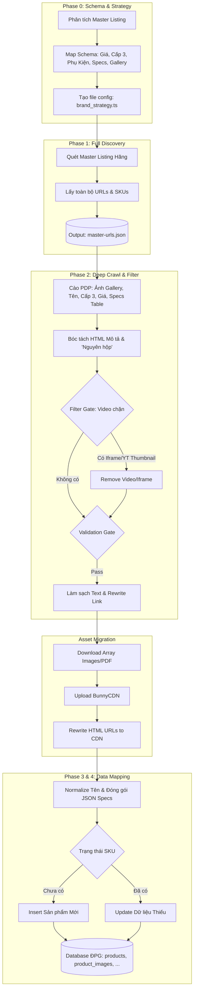

# 🏗️ MASTER BLUEPRINT: UNIVERSAL BRAND CRAWL PIPELINE
**Version**: 2.1.0
**Author**: Antigravity Orchestrator (Data Engineer x Docs Architect)
**Target**: Data Pipeline tiêu chuẩn hóa cho việc thu thập TỔNG LỰC, làm sạch và tích hợp/upsert dữ liệu sản phẩm đa thương hiệu (INAX, CAESAR, VIGLACERA,...) vào hệ thống Đồng Phú Gia.

---

## 1. TỔNG QUAN KIẾN TRÚC (ETL DATA PIPELINE - FULL UPSERT MODE)

Quy trình áp dụng cơ chế **UPSERT**: Bổ sung sản phẩm mới và CẬP NHẬT/LÀM ĐẦY dữ liệu cho các sản phẩm đã tồn tại trong DB, trích xuất kiệt để toàn bộ Media và JSON Specs.

---

## 2. QUY TRÌNH THỰC THI CHI TIẾT (S.O.P)

### Giai Đoạn 0: Research & Schema Mapping
**Tuyệt đối không viết code khi chưa nắm rõ sơ đồ trang web đích.**
- [ ] Phân tích Master Listing.
- [ ] Khảo sát **Quy tắc đặt tên** (Naming Convention) của hãng.
- [ ] Khảo sát DOM Selector để bắt chính xác Data Schema của ĐPG:
  - Các loại Giá: Gốc, Giảm, Giảm online.
  - Danh mục cấp 3 (Product Sub Type).
  - **Khối Gallery Ảnh**: Chú ý bóc tách mảng ảnh và gạt bỏ link video YouTube (`ytimg.com`).
  - **Khối Thông số kỹ thuật**: Phân tích bảng (Table) để trích xuất Key-Value (thương hiệu, xuất xứ...).
  - Vị trí giấu **"Nguyên hộp bao gồm"** để lấy Accessories.

### Giai Đoạn 1: Full Discovery
- [ ] Khởi chạy Crawler trỏ trực tiếp vào trang Master Listing.
- [ ] Trích xuất toàn bộ cặp `[URL, SKU]` và lưu vào `output/[brand]-master-urls.json`. KHÔNG BỎ QUA CÁC SKU ĐÃ CÓ.

### Giai Đoạn 2: Exhaustive Deep Crawl & Asset Migration
1. **Cào Kiệt Để & Chống Rác (Filter Gate)**:
   - **Gallery**: Lấy mảng ảnh. **Filter chặn**: Quét Regex loại bỏ bất kỳ url nào chứa `ytimg.com`, `youtube.com`, `vimeo`.
   - **Technical Specs**: Parse HTML Table thành dạng Object JSON.
   - **Tab Tài liệu**: Chú ý bẫy Scope. Lấy PDF từ thẻ `<a href$=".pdf">` bằng cách truy vấn *Global DOM* (`$('a')`) vì PDF có thể nằm ngoài khối HTML mô tả (`.description-content`).
   - **Mô tả (`description`)**: Lấy 100% HTML của khối mô tả. **Dùng Cheerio xóa toàn bộ thẻ `<iframe/>`, `<video/>` khỏi HTML để đảm bảo không dính video rác.**
   - **Xử lý Hình Ảnh (Lazy Load Trap)**: Loop qua toàn bộ thẻ `` trong Description. Đổi `data-src` thành `src` thật. Xóa bỏ class `lazy` và thuộc tính `data-src` để chống xung đột Frontend.

2. **Sanitization & Asset Migration (URL Corruption Protection)**:
   - Khi xóa văn mẫu quảng cáo, **TUYỆT ĐỐI KHÔNG** dùng Replace Global trực tiếp (VD: `replace(/hita/gi, 'Đồng Phú Gia')`) mà chưa bảo vệ các đường link hình ảnh (`src`) và hyperlink (`href`).
   - *Quy trình chuẩn*: Mã hóa chuỗi URL nội bộ (encode `hita` -> `h_i_t_a`) -> Clean Text HTML -> Giải mã khôi phục lại URL (`h_i_t_a` -> `hita`).
   - Download toàn bộ Hình ảnh (của Mô tả & Gallery) và PDF (nếu cần thiết cho bảo mật nội bộ) -> Đẩy thẳng lên **BunnyCDN**.

### Giai Đoạn 3: Data Mapping, Deep Image Migration & Khớp nối (Upsert)
- [x] **Deep Image Migration (Chống Hotlink mô tả)**:
  - Bắt buộc parse HTML bài viết mô tả bằng Cheerio.
  - Tải tất cả các ảnh đang hiển thị trong bài viết (`` src) về BunnyCDN.
  - Thay thế URL cũ bằng URL nội bộ để cắt đứt liên kết băng thông với đối thủ.
- [ ] **Chuẩn hóa Tên sản phẩm**: Loại bỏ các tiền tố không cần thiết, đưa về cấu trúc thống nhất.
- [ ] **Ánh xạ Danh mục cấp 3 (Category Mapping) & Hotfixes**:
  - Tự động gán `product_type` và `product_sub_type` dựa trên Breadcrumbs và Regex tên.
  - *Quy tắc ưu tiên*:
    1. **Vật lý trước, Tính năng sau**: Bồn cầu treo tường có nắp điện tử -> ưu tiên `bon-cau-treo-tuong` thay vì `bon-cau-thong-minh`.
    2. **Khớp cụm từ chính xác**: "Tay sen" chỉ được map vào `tay-sen` nếu đi kèm thương hiệu & SKU và KHÔNG chứa từ khóa "tay gạt", "tay gạt củ sen", "nắp chụp" (đưa các loại này về `phu-kien-sen-tam`).
    3. **Bộ phận rời vs Trọn bộ**: "Sen tắm" không chứa chữ "Bộ" -> `cu-sen` (Củ sen rời). Có chữ "Bộ" hoặc "Cây", "Đứng" -> `sen-dung` hoặc `sen-tam`.
    4. **Bộ phận đơn lẻ**: "Thân vòi", "núm vặn", "nắp chụp", "ốc" -> Đưa về phụ kiện (`phu-kien-voi` hoặc `phu-kien-sen-tam`).
- [x] **Làm sạch mã SKU (Data Cleansing)**: Xóa bỏ các tiền tố SEO rác (VD: `BON-CAU-1-KHOI-INAX-AC-939VN` -> `AC-939VN`). Bắt lỗi `Unique Constraint` để tự động xóa (prune) các bản sao bị sinh trùng lặp.
- [ ] **Gói Specs Chuẩn**: Gộp Technical Specs, Accessories và Documents Links vào 1 object JSON lưu vào trường `products.specs`.
- [ ] **Ghi Hình Ảnh**: Lưu mảng Gallery vào bảng `product_images` (ảnh đầu tiên vào `image_main_url`).
- [ ] **UPSERT DATABASE**:
  - `If (SKU doesn't exist)`: `prisma.products.create()`.
  - `If (SKU exists)`: `prisma.products.update()` (Đắp thêm ảnh Gallery mới, giá cập nhật, thông số kỹ thuật và phụ kiện).

### Giai Đoạn 4: Sync Quan Hệ & Audit
- [ ] Tách các sản phẩm bị gộp chung thành nhiều SKU (Variant Expansion).
- [ ] Gộp nhóm và ẩn Biến thể (Variant Grouping): Xác định sản phẩm Master và gán biến thể liên quan.
- [ ] Cập nhật bảng `product_relationships` để đồng bộ Combo (Parent - Child).
- [ ] Chạy Audit Report đếm số lượng lỗi 404, check data null, check rác text đối thủ.

