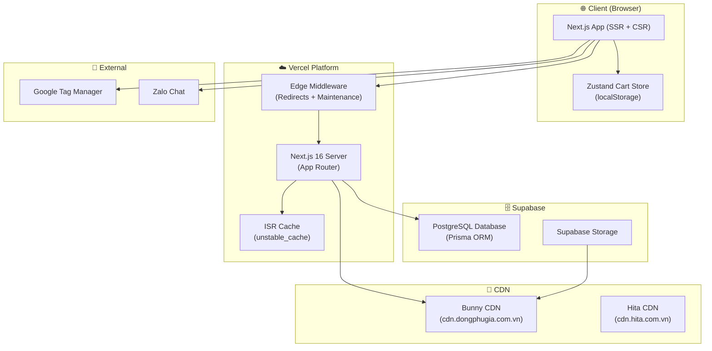
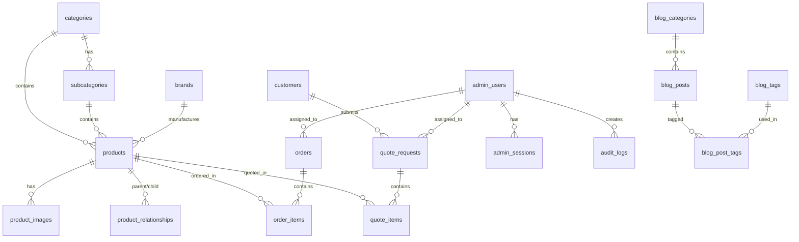
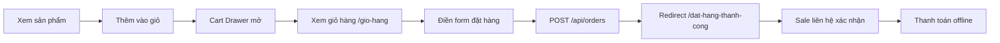
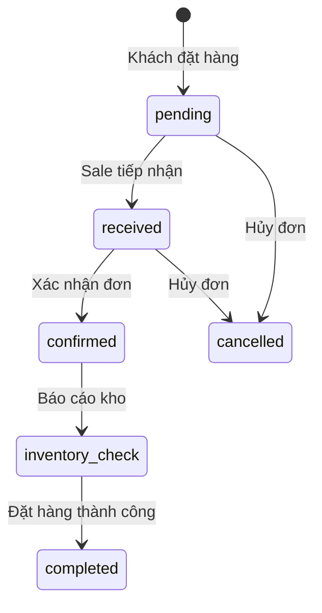
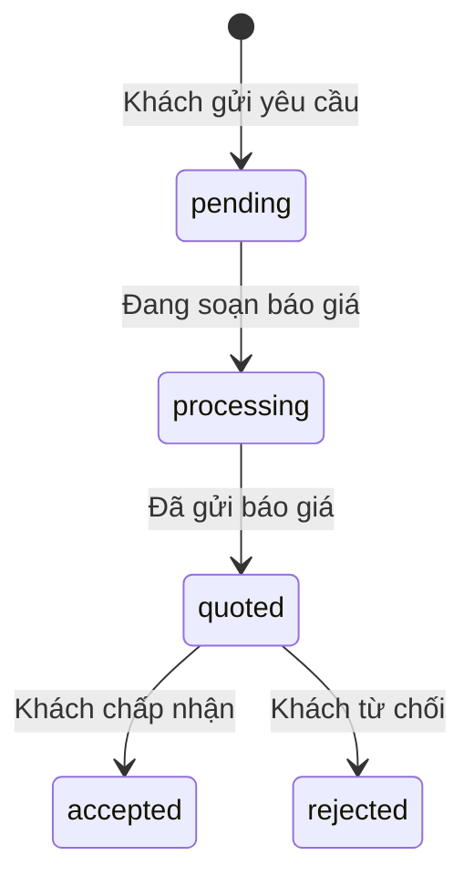
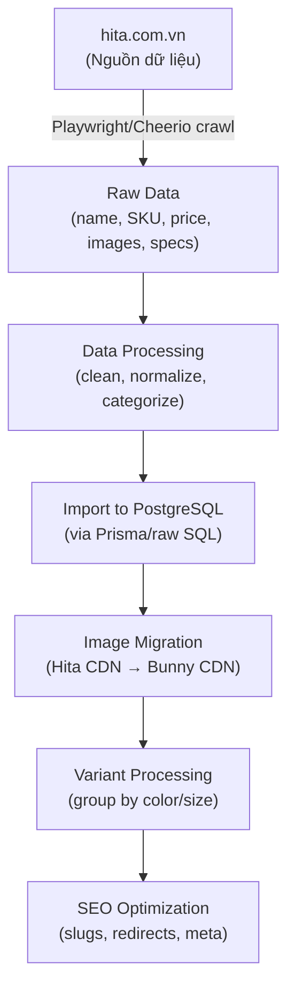

# 📋 TÀI LIỆU BÀN GIAO DỰ ÁN — ĐÔNG PHÚ GIA

> **Phiên bản**: 1.0 | **Ngày**: 2026-05-27  
> **Domain**: [dongphugia.com.vn](https://dongphugia.com.vn)  
> **Repository**: `tranhuunguyenhuy-hue/dongphugia.com.vn`  
> **Trạng thái**: ✅ Production — đang chạy trên Vercel

---

## MỤC LỤC

1. [Tổng Quan Dự Án](#1-tổng-quan-dự-án)
2. [Kiến Trúc Hệ Thống](#2-kiến-trúc-hệ-thống)
3. [Tech Stack](#3-tech-stack)
4. [Cấu Trúc Codebase](#4-cấu-trúc-codebase)
5. [Database Schema](#5-database-schema)
6. [Trang Public (Khách hàng)](#6-trang-public-khách-hàng)
7. [Admin Panel (CMS)](#7-admin-panel-cms)
8. [API Routes & Server Actions](#8-api-routes--server-actions)
9. [Hệ Thống Giỏ Hàng & Đặt Hàng](#9-hệ-thống-giỏ-hàng--đặt-hàng)
10. [SEO Infrastructure](#10-seo-infrastructure)
11. [Data Pipeline (Crawl & Import)](#11-data-pipeline-crawl--import)
12. [Deploy & Vận Hành](#12-deploy--vận-hành)
13. [Dịch Vụ Bên Ngoài](#13-dịch-vụ-bên-ngoài)
14. [Known Issues & Technical Debt](#14-known-issues--technical-debt)
15. [Roadmap Phát Triển](#15-roadmap-phát-triển)
16. [Hướng Dẫn Vận Hành Hàng Ngày](#16-hướng-dẫn-vận-hành-hàng-ngày)

---

## 1. Tổng Quan Dự Án

### Đông Phú Gia là gì?

Website thương mại điện tử B2C cho **Đông Phú Gia** — nhà phân phối vật liệu xây dựng cao cấp tại **Đà Lạt, Lâm Đồng**. Website phục vụ:

- **Trưng bày sản phẩm** (catalog) với hàng ngàn SKU
- **Đặt hàng online** (chưa có thanh toán online — luồng: đặt đơn → sale liên hệ xác nhận → thanh toán offline)
- **Yêu cầu báo giá** cho dự án/số lượng lớn
- **Blog/Tin tức** về ngành VLXD
- **Quản lý nội bộ** qua Admin Panel (CMS)

### Địa chỉ & Liên hệ

| Thông tin | Giá trị |
|-----------|---------|
| Địa chỉ | 273–275 Phan Đình Phùng, Phường 2, Đà Lạt, Lâm Đồng |
| Hotline | 094 9349 949 / 094 5343 494 |
| Phòng kinh doanh | 0855 528 688 |
| Email | vlxd.dongphu@gmail.com |
| Giờ làm việc | Thứ 2 – CN: 07:30 – 17:00 |

### 4 Danh Mục Sản Phẩm Chính

| # | Danh mục | URL | Trạng thái dữ liệu |
|---|----------|-----|---------------------|
| 1 | Thiết bị vệ sinh | `/thiet-bi-ve-sinh` | ✅ TOTO đầy đủ nhất, các hãng khác cơ bản |
| 2 | Thiết bị bếp | `/thiet-bi-bep` | 📦 Có sản phẩm, chưa đầy đủ |
| 3 | Gạch ốp lát | `/gach-op-lat` | 📦 Có sản phẩm (Vietceramics), chưa đầy đủ |
| 4 | Vật liệu nước | `/vat-lieu-nuoc` | 📦 Có sản phẩm, chưa đầy đủ |

> [!IMPORTANT]
> **Chỉ TOTO** (thuộc Thiết bị vệ sinh) là thương hiệu có dữ liệu đầy đủ nhất. Hệ thống **biến thể sản phẩm (variant system)** đang trong quá trình phát triển cho TOTO. Sau khi hoàn thiện, pipeline sẽ được áp dụng cho các thương hiệu/danh mục còn lại.

---

## 2. Kiến Trúc Hệ Thống



### Luồng Request Chính

1. **User truy cập** → Edge Middleware kiểm tra maintenance mode + 301 redirects (3,323 old-slug mappings)
2. **Server Components** fetch data từ PostgreSQL qua Prisma, cache qua `unstable_cache`
3. **Images** serve từ Bunny CDN (`cdn.dongphugia.com.vn`) hoặc Hita CDN (legacy)
4. **Cart** lưu client-side (Zustand + localStorage), submit đơn qua API route
5. **Admin** xác thực bằng custom session-based auth, lưu trên PostgreSQL

---

## 3. Tech Stack

### Core Framework

| Layer | Technology | Version |
|-------|-----------|---------|
| Framework | Next.js (App Router) | 16.2.3 |
| Runtime | React | 19.2.3 |
| Language | TypeScript | 5.9.3 |
| CSS | Tailwind CSS | v4 |
| ORM | Prisma Client | 5.22.0 |
| Database | PostgreSQL (Supabase) | — |
| Hosting | Vercel | — |

### Key Libraries

| Library | Mục đích |
|---------|----------|
| `zustand` | Client-side state management (giỏ hàng) |
| `@tiptap/react` | Rich text editor (admin blog/product editor) |
| `radix-ui` + `shadcn/ui` | Component library (UI primitives) |
| `lucide-react` | Icon library |
| `recharts` | Charts (admin dashboard) |
| `@tanstack/react-table` | Data tables (admin) |
| `@dnd-kit` | Drag-and-drop (image reorder) |
| `react-hook-form` + `zod` | Form management + validation |
| `sonner` | Toast notifications |
| `bcryptjs` | Password hashing (admin auth) |
| `sharp` | Image optimization |
| `cheerio` | HTML parsing (crawlers) |
| `react-to-print` | Print order/quote documents |
| `date-fns` | Date formatting |
| `cmdk` | Command palette UI |
| `@next/third-parties` | Google Tag Manager integration |
| `next-themes` | Dark/light theme switching |

### Dev Tools

| Tool | Mục đích |
|------|----------|
| `vitest` | Unit testing |
| `playwright` | Browser automation (crawlers) |
| `eslint` | Linting |
| `tsx` | TypeScript script runner |

### Fonts

- **Body**: Be Vietnam Pro (300–700)
- **Display/Heading**: Playfair Display (400–900)

---

## 4. Cấu Trúc Codebase

```
dongphugia/
├── prisma/
│   ├── schema.prisma          # Database schema (598 dòng, 20+ models)
│   ├── migrations/            # SQL migrations
│   ├── seed.ts                # DB seeding
│   └── seed-admin.ts          # Admin user seeding
│
├── public/                    # Static assets (images, icons, robots.txt)
│
├── scripts/                   # Data pipeline scripts
│   ├── crawl-toto/            # TOTO product crawlers
│   ├── crawl-inax/            # INAX product crawlers
│   ├── product-import/        # Import pipelines
│   ├── variant-pipeline/      # Variant processing (multi-phase)
│   ├── db/                    # Database utilities & migrations
│   ├── seed/                  # Seed data scripts
│   └── ...                    # Analysis, export, fix scripts
│
├── src/
│   ├── app/
│   │   ├── (public)/          # Public-facing pages
│   │   │   ├── page.tsx       # Homepage
│   │   │   ├── thiet-bi-ve-sinh/    # Category: TBVS
│   │   │   │   ├── page.tsx         # Category listing
│   │   │   │   └── [sub]/           # Subcategory
│   │   │   │       ├── page.tsx     # Product listing
│   │   │   │       └── [slug]/      # Product detail
│   │   │   ├── thiet-bi-bep/       # Category: Bếp
│   │   │   ├── gach-op-lat/        # Category: Gạch
│   │   │   ├── vat-lieu-nuoc/      # Category: Nước
│   │   │   ├── blog/               # Blog listing + detail
│   │   │   ├── gio-hang/           # Cart + checkout
│   │   │   ├── dat-hang-thanh-cong/ # Order success
│   │   │   ├── tim-kiem/           # Search results
│   │   │   ├── lien-he/            # Contact page
│   │   │   ├── ve-chung-toi/       # About us
│   │   │   ├── doi-tac/            # Partners
│   │   │   ├── du-an/              # Projects
│   │   │   ├── dich-vu-lap-dat/    # Installation services
│   │   │   └── design-system/      # Dev-only design system page
│   │   │
│   │   ├── admin/             # Admin panel
│   │   │   ├── login/         # Admin login
│   │   │   └── (dashboard)/   # Protected admin pages
│   │   │       ├── products/       # Product CRUD
│   │   │       ├── categories/     # Category management
│   │   │       ├── orders/         # Order management
│   │   │       ├── quote-requests/ # Quote management
│   │   │       ├── customers/      # Customer CRM
│   │   │       ├── blog/           # Blog CMS
│   │   │       ├── banners/        # Banner management
│   │   │       ├── users/          # Admin user RBAC
│   │   │       ├── content/        # Content pages (category banners)
│   │   │       ├── doi-tac/        # Partners management
│   │   │       └── du-an/          # Projects management
│   │   │
│   │   ├── api/               # API routes
│   │   │   ├── search/        # Product search
│   │   │   ├── orders/        # Order creation
│   │   │   ├── quote-requests/# Quote submission
│   │   │   ├── upload-image/  # Image upload to Bunny CDN
│   │   │   ├── revalidate/    # Cache invalidation
│   │   │   ├── health/        # Health check
│   │   │   ├── sitemap/       # Dynamic product sitemaps
│   │   │   └── admin/         # Admin API routes
│   │   │
│   │   ├── actions/           # Server Actions
│   │   ├── maintenance/       # Maintenance mode page
│   │   ├── globals.css        # Global styles
│   │   └── layout.tsx         # Root layout (fonts, GTM, JSON-LD)
│   │
│   ├── components/
│   │   ├── admin/             # Admin-specific components
│   │   ├── blog/              # Blog components
│   │   ├── cart/              # Cart drawer, checkout form
│   │   ├── category/          # Category listing, filters
│   │   ├── home/              # Homepage sections
│   │   ├── layout/            # Header, footer, mega menu
│   │   ├── product/           # Product detail components
│   │   ├── seo/               # JSON-LD, structured data
│   │   ├── tracking/          # Analytics components
│   │   └── ui/                # shadcn/ui primitives
│   │
│   ├── config/
│   │   ├── site.ts            # Site config (contact, navigation)
│   │   └── subcategory-images.ts
│   │
│   ├── data/
│   │   └── product-redirect-map.json  # 3,323 old→new slug redirects
│   │
│   ├── hooks/
│   │   └── use-mobile.ts      # Mobile breakpoint hook
│   │
│   ├── lib/
│   │   ├── auth/              # Admin authentication system
│   │   │   ├── admin-auth-actions.ts  # Login/logout/session
│   │   │   ├── auth-helpers.ts        # bcrypt wrappers
│   │   │   └── auth-types.ts          # Type definitions
│   │   ├── seo/               # SEO utilities
│   │   │   └── schema.ts      # JSON-LD schema builders
│   │   ├── prisma.ts          # Prisma client singleton
│   │   ├── cache.ts           # Cache strategy (unstable_cache)
│   │   ├── cart-store.ts      # Zustand cart store
│   │   ├── public-api-products.ts  # Product data fetching (892 lines)
│   │   ├── product-actions.ts      # Product CRUD (491 lines)
│   │   ├── order-actions.ts        # Order business logic (398 lines)
│   │   ├── blog-actions.ts         # Blog CRUD
│   │   ├── actions.ts              # Misc actions (banners, quotes, contact)
│   │   ├── rate-limiter.ts         # In-memory rate limiting
│   │   ├── tracking.ts             # Analytics event helpers
│   │   └── ...                     # Other utilities
│   │
│   ├── utils/                 # Utility functions
│   └── middleware.ts          # Edge middleware (redirects + maintenance)
│
├── next.config.ts             # Next.js config (images, rewrites, redirects, headers)
├── package.json
├── tsconfig.json
├── vitest.config.ts
└── vercel.json
```

---

## 5. Database Schema

Database: **PostgreSQL** trên **Supabase** | ORM: **Prisma 5.22.0**

### Sơ đồ quan hệ chính



### Danh sách Models (20 bảng)

#### Sản phẩm (Product Information Management)

| Model | Mô tả | Số dòng quan trọng |
|-------|--------|---------------------|
| `products` | Sản phẩm chính — 40+ trường bao gồm SKU, giá, variant_group, is_combo, is_master, search_vector (FTS), specs (JSONB) | Core table |
| `categories` | 4 danh mục chính (TBVS, Bếp, Gạch, Nước) | |
| `subcategories` | Danh mục con (bồn cầu, sen tắm, lavabo...) | |
| `brands` | Thương hiệu (TOTO, INAX, Caesar, Kohler...) | |
| `product_images` | Gallery ảnh sản phẩm (main/gallery type) | |
| `product_relationships` | Quan hệ combo/component/accessory giữa sản phẩm | |
| `product_secondary_subcategories` | Junction table — sản phẩm thuộc nhiều subcategory | |
| `product_features` + `product_feature_values` | Tính năng sản phẩm (nước xả, chống bẩn...) | |
| `filter_definitions` | Bộ lọc động theo danh mục (JSONB options) | |
| `colors`, `materials`, `origins` | Lookup tables (màu sắc, chất liệu, xuất xứ) | |

#### Bán hàng (Order Management System)

| Model | Mô tả |
|-------|--------|
| `orders` + `order_items` | Đơn hàng — status workflow: pending → received → confirmed → inventory_check → completed / cancelled |
| `quote_requests` + `quote_items` | Yêu cầu báo giá — status: pending → processing → quoted → accepted / rejected |
| `customers` | CRM khách hàng (unique by phone) |

#### Nội dung (Content Management)

| Model | Mô tả |
|-------|--------|
| `blog_posts` + `blog_categories` + `blog_tags` | Hệ thống blog với tags many-to-many |
| `banners` | Banner trang chủ & danh mục |
| `partners` | Đối tác (tier: Vàng/Bạc/Đồng) |
| `projects` | Dự án tiêu biểu |
| `redirects` | URL redirects (legacy — giờ dùng JSON file) |

#### Hệ thống (Admin & Security)

| Model | Mô tả |
|-------|--------|
| `admin_users` | Admin users với role: `admin` / `sale_manager` / `sale` |
| `admin_sessions` | Session tokens (SHA-256 hashed) |
| `audit_logs` | Audit trail — mọi thay đổi đều được ghi lại |

### Key Fields trong `products`

```
- sku (unique)                  # Mã sản phẩm
- slug (unique per category)    # URL-friendly name
- price / original_price        # Giá bán / Giá gốc
- online_discount_amount        # Giảm giá mua online
- price_display                 # "Liên hệ báo giá" nếu không có giá
- is_master                     # Sản phẩm chính (không phải variant)
- variant_group                 # Nhóm biến thể (VG-xxx)
- is_combo                      # Sản phẩm combo (bộ)
- is_featured / is_home_featured / is_promotion  # Flags hiển thị
- specs (JSONB)                 # Thông số kỹ thuật (key-value)
- search_vector (tsvector)      # Full-text search vector (Vietnamese)
- component_skus (String[])     # SKU các thành phần (combo)
- product_type / product_sub_type  # Phân loại phụ
```

---

## 6. Trang Public (Khách hàng)

### 6.1 Homepage (`/`)

| Section | Component | Mô tả |
|---------|-----------|--------|
| Hero Banner | `HeroBanner` | Carousel ảnh từ DB (banners table, position="HERO"), max 5 slides |
| Brand Slider | `BrandSlider` | Marquee vô hạn 27 logo thương hiệu |
| Featured Products ×4 | `HomeCategoryBlockAlt` | Tabs brand/subcategory filtering cho mỗi danh mục, horizontal scroll |
| Blog Preview | `BlogSection` | 8 bài viết mới nhất |
| Contact Form | `ContactSection` | Inline form (tên, SĐT, email, nội dung) |

**Cache**: `revalidate = 3600` (1 giờ)

### 6.2 Category Pages (`/thiet-bi-ve-sinh`, `/thiet-bi-bep`, `/gach-op-lat`, `/vat-lieu-nuoc`)

**URL Pattern**: `/{category}` → `/{category}/{subcategory}` → `/{category}/{subcategory}/{product-slug}`

**Tính năng Listing**:
- Breadcrumb navigation
- Subcategory icon grid
- Advanced sidebar filter (desktop 290px sticky) + mobile Sheet drawer
- Lọc theo: Brand, Features, Material, Origin, Color, Price range, Spec filters
- Sort: Mặc định, Giá tăng/giảm, Mới nhất
- Active filter chips (remove individual filters)
- Product grid responsive (2→3→4 cột)
- Pagination: 24 items/page

**Cache**: `revalidate = 10800` (3 giờ)

### 6.3 Product Detail (`/{category}/{sub}/{slug}`)

**Layout**: 2 cột desktop (gallery trái, info phải sticky)

| Section | Mô tả |
|---------|--------|
| Image Gallery | Main image + gallery thumbnails, discount badge |
| Product Info | Tên, SKU, Brand badge, Stock status, Color swatch |
| Variant Selector | Hiện nếu có `variant_group` — switch giữa các biến thể |
| Price + CTA | Giá gốc/giảm/online discount, "Thêm vào giỏ" (có tùy chọn lắp đặt), "Gọi đặt hàng", "Chat Zalo" |
| Box Includes | Phụ kiện đi kèm (từ `specs['Phụ kiện đi kèm']`) |
| Components | Sản phẩm thành phần (nếu is_combo) |
| Tabs | Mô tả / Thông số kỹ thuật / Tính năng |
| Related Products | 4 sản phẩm cùng subcategory |

**Cache**: `revalidate = 21600` (6 giờ) | **SEO**: JSON-LD Product schema + Breadcrumb schema

### 6.4 Cart & Checkout

| Trang | URL | Mô tả |
|-------|-----|--------|
| Cart Drawer | (component) | Sheet slide-in từ phải, max 420px, hiện khi thêm sản phẩm |
| Cart Page | `/gio-hang` | Full cart + checkout form (tên, SĐT, email, địa chỉ, ghi chú) |
| Order Success | `/dat-hang-thanh-cong?order=XXX` | Xác nhận đơn hàng + hướng dẫn bước tiếp theo |

**Cart Store**: Zustand + localStorage persist, key: `dpg-cart`
- Hỗ trợ tùy chọn lắp đặt (`none` / `install` / `replace`)
- Cùng sản phẩm + khác tùy chọn lắp đặt = cart items riêng biệt
- Max quantity: 99

### 6.5 Các Trang Khác

| Trang | URL | Mô tả |
|-------|-----|--------|
| Tìm kiếm | `/tim-kiem?q=...` | Full-text search, grid 5 cột, pagination, gợi ý từ khóa |
| Blog Listing | `/tin-tuc` (rewrite → `/blog`) | Featured post + grid, sidebar (categories, tags), pagination |
| Blog Detail | `/tin-tuc/{category}/{post}` | Cover image, content, TOC sidebar (sticky), related posts |
| Liên hệ | `/lien-he` | Contact info cards + form + Google Maps embed |
| Về chúng tôi | `/ve-chung-toi` | Editorial page với scroll animations, counter effects |
| Đối tác | `/doi-tac` | Bento grid layout, brand marquee, tier badges |
| Dự án | `/du-an` | Gallery với filter tabs, masonry layout, hover overlays |
| Dịch vụ lắp đặt | `/dich-vu-lap-dat` | Quy trình 4 bước, bảng giá dịch vụ |
| Design System | `/design-system` | Dev reference (không link trong nav) |

---

## 7. Admin Panel (CMS)

### 7.1 Authentication

| Thành phần | Chi tiết |
|-----------|----------|
| **Phương thức** | Custom session-based auth (không dùng NextAuth/Supabase Auth cho admin) |
| **Login** | Email hoặc username + password |
| **Password** | bcrypt (12 rounds) |
| **Session** | Token 64 hex chars → SHA-256 hash lưu DB (`admin_sessions`) |
| **Cookie** | `dpg-admin-session` (httpOnly, secure in production, sameSite=lax) |
| **Duration** | 8 giờ (configurable via `SESSION_HOURS` env) |
| **Rate Limit** | Max 5 login attempts per IP, lockout 15 phút |
| **Anti-enumeration** | Constant-time response (luôn hash dù user không tồn tại) |

### 7.2 RBAC (Role-Based Access Control)

**3 roles**: `admin` → `sale_manager` → `sale`

| Permission | Admin | Sale Manager | Sale |
|-----------|:-----:|:------------:|:----:|
| Dashboard (all data) | ✅ | ✅ | ❌ |
| Dashboard (own data) | ✅ | ❌ | ✅ |
| Products (read) | ✅ | ✅ | ✅ |
| Products (write/delete) | ✅ | ❌ | ❌ |
| Categories (read/write) | ✅ | ❌ | ❌ |
| Orders (all) | ✅ | ✅ | ❌ |
| Orders (assigned only) | ✅ | ❌ | ✅ |
| Orders (assign staff) | ✅ | ✅ | ❌ |
| Orders (update status) | ✅ | ✅ | ✅ |
| Quotes (all) | ✅ | ✅ | ❌ |
| Quotes (assigned only) | ✅ | ❌ | ✅ |
| Quotes (create/update) | ✅ | ✅ | ✅ |
| Customers (read) | ✅ | ✅ | ✅ |
| Customers (write) | ✅ | ✅ | ❌ |
| Blog (read/write) | ✅ | ❌ | ❌ |
| Banners | ✅ | ❌ | ❌ |
| Users (read/write) | ✅ | ❌ | ❌ |

### 7.3 Admin Pages

| Route | Chức năng | Nổi bật |
|-------|----------|---------|
| `/admin` | Dashboard tổng quan | Bảng sản phẩm mới, tab đơn hàng/báo giá pending |
| `/admin/products` | Quản lý sản phẩm | Search, filter (category/brand/status), pagination 50/page |
| `/admin/products/new` hoặc `[id]` | CRUD sản phẩm | Form 40+ trường, TipTap editor, image gallery dnd-kit, variant management, relationship picker |
| `/admin/categories` | Quản lý danh mục | Categories + subcategories + filter definitions |
| `/admin/orders` | Quản lý đơn hàng | Revenue highlight, status filters, search, pagination 25/page |
| `/admin/orders/[id]` | Chi tiết đơn hàng | Order Builder, A4 print template, staff assignment, status workflow |
| `/admin/quote-requests` | Quản lý báo giá | RBAC filtering (sale chỉ thấy assigned), status tabs với count |
| `/admin/quote-requests/[id]/builder` | Soạn báo giá | Quote Builder, A4 print template, VAT/shipping config |
| `/admin/customers` | CRM khách hàng | Search, form, linked orders/quotes |
| `/admin/blog/posts` | Blog CMS | TipTap editor (27KB), tags, SEO fields, draft/published workflow |
| `/admin/blog/tags` | Tags management | CRUD tags |
| `/admin/content/banners` | Category banners | Upload banner 16:9 per category |
| `/admin/banners` | Homepage banners | CRUD (⚠️ không trong sidebar — chỉ qua URL trực tiếp) |
| `/admin/doi-tac` | Đối tác | CRUD (⚠️ không trong sidebar) |
| `/admin/du-an` | Dự án | CRUD (⚠️ không trong sidebar) |
| `/admin/users` | Quản lý tài khoản | Create/edit users, role assignment, deactivate (admin only) |

> [!WARNING]
> **Các trang ẩn**: `/admin/banners`, `/admin/doi-tac`, `/admin/du-an` tồn tại nhưng **KHÔNG xuất hiện trong sidebar navigation**. Truy cập qua URL trực tiếp.
>
> **Dead links trong sidebar**: "Cài đặt" (`/admin/settings`) — không có trang thực tế. "Feedback" và "Liên hệ hỗ trợ" — chỉ là anchor links `#`.

---

## 8. API Routes & Server Actions

### 8.1 API Routes

| Route | Method | Mô tả | Auth | Rate Limit |
|-------|--------|--------|:----:|:----------:|
| `/api/search` | GET | Full-text product search (Vietnamese tsvector + ILIKE fallback) | ❌ | ❌ |
| `/api/orders` | POST | Tạo đơn hàng (DPG-YYYYMMDD-XXXX) | ❌ | ❌ |
| `/api/quote-requests` | GET/POST | Lookup quote history / Tạo báo giá | ❌ | ✅ (10/5 req/min) |
| `/api/upload-image` | POST | Upload ảnh lên Bunny CDN (JPG/PNG/WebP, max 5MB) | ❌ ⚠️ | ❌ |
| `/api/revalidate` | POST | Cache invalidation (cross-domain) | Token ✅ | ❌ |
| `/api/admin/revalidate` | POST/GET | Admin cache busting | Optional | ❌ |
| `/api/health` | GET | Health check + DB connectivity | ❌ | ❌ |
| `/api/sitemap/[id]` | GET | Dynamic product sitemap (2000/page) | ❌ | ❌ |
| `/api/sitemap_static` | GET | Static pages sitemap | ❌ | ❌ |
| `/api/admin/*` | Various | Admin CRUD endpoints | Session ✅ | ❌ |

### 8.2 Server Actions

| Action | File | Mô tả |
|--------|------|--------|
| `getMegaMenuData()` | `actions/mega-menu-actions.ts` | Build mega menu data (cached) |
| `fetchFeaturedProductsAction()` | `actions/home-products.ts` | Featured products cho homepage |
| `submitContactForm()` | `lib/actions.ts` | Contact form → upsert customer |
| `submitQuoteRequest()` | `lib/actions.ts` | Tạo quote request |
| `adminLogin()` / `adminLogout()` | `lib/auth/admin-auth-actions.ts` | Admin auth flow |
| `createOrder()` | `lib/order-actions.ts` | Order creation với transaction |
| `createProduct()` / `updateProduct()` | `lib/product-actions.ts` | Product CRUD |
| `createBlogPost()` / `updateBlogPost()` | `lib/blog-actions.ts` | Blog CMS |
| `createBanner()` / `updateBanner()` | `lib/actions.ts` | Banner CRUD |

### 8.3 Caching Strategy

| Data | TTL | Cache Tag |
|------|-----|-----------|
| Categories | 1h | `categories` |
| Subcategories | 1h | `subcategories` |
| Brands | 1h | `brands` |
| Colors/Materials/Origins | 24h | `colors`, `materials`, `origins` |
| Product filters | 1h | `filter_definitions` |
| Product listing | 3h | `products-{category}` |
| Product detail | 30min | `product-{slug}` |
| Variant siblings | 1h | — |
| Blog posts | 1h | — |
| Mega menu | Cached (React.cache) | `mega-menu` |

**Invalidation**: Qua 2 endpoints (`/api/revalidate` + `/api/admin/revalidate`) sử dụng `revalidateTag()`.

---

## 9. Hệ Thống Giỏ Hàng & Đặt Hàng

### Luồng mua hàng



### Order Status Workflow



### Quote Status Workflow



### Tùy chọn lắp đặt

Khi thêm sản phẩm vào giỏ, khách có thể chọn:
- `none` — Mua sản phẩm (không lắp đặt)
- `install` — Mua + lắp mới
- `replace` — Mua + tháo cũ + lắp mới

Phí lắp đặt được cộng vào giá sản phẩm trong giỏ hàng.

---

## 10. SEO Infrastructure

### Structured Data (JSON-LD)

| Schema | Trang | Nội dung |
|--------|-------|----------|
| `LocalBusiness` | Tất cả (root layout) | Tên, địa chỉ Đà Lạt, SĐT, email, giờ mở cửa, social links |
| `Product` | Product detail | Tên, giá (VND), availability, brand, images, canonical URL |
| `BreadcrumbList` | Product + Category | Navigation path |
| `Article` | Blog detail | Title, author, publisher, datePublished |

### Sitemap

- **Index**: `/sitemap.xml` → trỏ tới `sitemap_static.xml` + `sitemap_product_1.xml`, `sitemap_product_2.xml`, ...
- **Static**: Trang tĩnh + blog posts
- **Dynamic**: 2000 products/file, cache 24h
- **URL rewrite**: `/sitemap_product_:id.xml` → `/api/sitemap/:id`

### Meta Tags

- Dynamic `<title>` với template `%s | Đông Phú Gia`
- Canonical URLs trên tất cả trang
- OpenGraph (title, description, image, locale: `vi_VN`)
- Twitter Card (`summary_large_image`)
- `robots: index, follow` (trừ cart và order success)
- `lang="vi"` trên `<html>`

### Security Headers

```
X-Frame-Options: SAMEORIGIN
X-Content-Type-Options: nosniff
Referrer-Policy: strict-origin-when-cross-origin
Permissions-Policy: camera=(), microphone=(), geolocation=(), interest-cohort=()
```

### URL Redirects

- **3,323 old→new slug redirects** trong `src/data/product-redirect-map.json` — xử lý ở Edge Middleware
- **Category query param redirects** trong `next.config.ts` (`?sub=X` → `/X`)

---

## 11. Data Pipeline (Crawl & Import)

### Quy trình nhập sản phẩm



### Scripts chính

| Script | Mục đích | Vị trí |
|--------|----------|--------|
| `scripts/crawl_toto_v2.ts` | Crawl TOTO từ Hita (chính) | 25KB, resumable |
| `scripts/crawl-inax/` | Crawl INAX | Riêng directory |
| `scripts/product-import/crawl-vietceramics-*.mjs` | Crawl gạch Vietceramics | |
| `scripts/product-import/mirror-images.mjs` | Mirror images → Bunny CDN | |
| `scripts/variant-pipeline/` | Multi-phase variant processing | Phase 1-4 (bồn cầu, sen tắm, lavabo, mixed) |
| `scripts/db/` | DB migrations, audits, fixes | 30+ scripts |
| `scripts/seed/` | Seed lookup tables, filters | |
| `migrate-hita.js` (root) | Legacy image migration | Hita → Bunny CDN |

> [!NOTE]
> Scripts crawl sử dụng **Playwright** (browser automation) để bypass JS-rendered content trên hita.com.vn. Progress được lưu vào JSON files để có thể resume khi bị gián đoạn.

---

## 12. Deploy & Vận Hành

### Deploy (Vercel)

| Setting | Giá trị |
|---------|---------|
| Platform | Vercel |
| Framework | Next.js |
| Build command | `next build` |
| Output | Serverless Functions + Edge |
| Domain | `dongphugia.com.vn` |
| Node.js | (Vercel default) |

### Quy trình Deploy

1. Push code lên branch `main` → Vercel auto-deploy
2. Preview deploy cho các branch khác
3. Vercel build chạy `prisma generate` (postinstall) → `next build`

### Rollback

- Vercel Dashboard → Deployments → chọn deployment cũ → "Promote to Production"
- Hoặc: `git revert` + push lên `main`

### Maintenance Mode

Trong `.env`:
```
MAINTENANCE_MODE=true
```
→ Edge Middleware rewrite tất cả request (trừ admin/api/static) sang `/maintenance`

### Cache Busting

Sau khi thay đổi data (admin CMS):
```bash
# Từ admin site hoặc script
curl -X POST https://dongphugia.com.vn/api/revalidate \
  -H "x-revalidation-secret: YOUR_SECRET" \
  -H "Content-Type: application/json" \
  -d '{"tags": ["products", "categories"]}'
```

---

## 13. Dịch Vụ Bên Ngoài

| Dịch vụ | Mục đích | Biến môi trường |
|---------|----------|-----------------|
| **Supabase** | PostgreSQL database + Storage | `DATABASE_URL`, `DIRECT_URL` |
| **Vercel** | Hosting & CDN | (auto) |
| **Bunny CDN** | Image CDN (`cdn.dongphugia.com.vn`) | `BUNNY_STORAGE_ZONE_NAME`, `BUNNY_STORAGE_API_KEY`, `BUNNY_STORAGE_HOSTNAME`, `BUNNY_CDN_HOSTNAME` |
| **Google Tag Manager** | Analytics tracking | `NEXT_PUBLIC_GTM_ID` |
| **Zalo** | Chat widget | Hardcoded link (`zalo.me/0855528688`) |
| **Google Maps** | Bản đồ trang liên hệ | Hardcoded embed URL |
| **Domain registrar** | `dongphugia.com.vn` | — |

### Environment Variables

```env
# Database — Supabase PostgreSQL
DATABASE_URL="postgresql://...?pgbouncer=true"  # Pooled connection
DIRECT_URL="postgresql://..."                    # Direct connection (migrations)

# Auth
AUTH_SECRET="..."                 # NextAuth secret (nếu dùng)

# Site
NEXT_PUBLIC_SITE_URL="https://dongphugia.com.vn"

# GTM
NEXT_PUBLIC_GTM_ID="GTM-XXXXX"

# Bunny CDN
BUNNY_STORAGE_ZONE_NAME="..."
BUNNY_STORAGE_API_KEY="..."
BUNNY_STORAGE_HOSTNAME="..."
BUNNY_CDN_HOSTNAME="cdn.dongphugia.com.vn"

# Cache
REVALIDATION_SECRET="..."       # Cross-domain revalidation
REVALIDATE_SECRET="..."         # Admin revalidation

# Maintenance
MAINTENANCE_MODE="false"

# Admin Auth
SESSION_HOURS="8"               # Admin session duration
```

---

## 14. Known Issues & Technical Debt

### 🔴 Critical (Cần fix sớm)

| # | Issue | Chi tiết |
|---|-------|----------|
| 1 | **Upload API không có auth** | `/api/upload-image` không kiểm tra session — ai cũng có thể upload lên Bunny CDN |
| 2 | **Order API không rate limit** | `/api/orders` không có rate limiting — có thể bị spam |
| 3 | **Search API không rate limit** | `/api/search` không rate limit — có thể bị abuse |

### 🟡 Medium (Technical Debt)

| # | Issue | Chi tiết |
|---|-------|----------|
| 4 | **Dual order number format** | REST API (`/api/orders`) dùng `DPG-YYYYMMDD-XXXX` (4 digit), Server Action (`createOrder`) dùng 6-digit random — không nhất quán |
| 5 | **Revenue chart chưa dùng** | `revenue-chart.tsx` tồn tại nhưng không được import vào dashboard |
| 6 | **Admin sidebar thiếu entries** | Banners, Đối tác, Dự án có pages nhưng không trong sidebar |
| 7 | **Dead links sidebar** | Settings, Feedback, Support — không có trang thực tế |
| 8 | **Google Analytics placeholder** | Dashboard hiện "Chưa tích hợp" cho analytics card |
| 9 | **Root dir pollution** | 50+ script files, logs, CSVs nằm ở root — cần dọn vào `/scripts/` |
| 10 | **`images.unoptimized: true`** | Next.js image optimization bị tắt — ảnh không được optimize |
| 11 | **Variant system chưa hoàn thiện** | `variant_group`, `is_master` logic đang develop — data chưa nhất quán |

### 🟢 Low (Nice to have)

| # | Issue | Chi tiết |
|---|-------|----------|
| 12 | **Health endpoint lộ thông tin** | `/api/health` trả về DB URL prefix — nên loại bỏ |
| 13 | **Blog "Xem thêm" không hoạt động** | Nút "Xem thêm bài viết" trên blog listing hiện chỉ là static |
| 14 | **In-memory rate limiter** | Reset khi cold start (serverless) — chấp nhận được cho anti-abuse cơ bản |

---

## 15. Roadmap Phát Triển

> Thứ tự ưu tiên do team xác nhận:

| # | Ưu tiên | Mô tả | Trạng thái |
|---|---------|--------|-----------|
| 1 | 🔴 **Variant System** | Hoàn thiện hệ thống biến thể sản phẩm cho TOTO (màu sắc, kích thước) | 🔄 Đang phát triển |
| 2 | 🟠 **Crawl thêm brands** | Mở rộng data pipeline cho INAX, Caesar, Kohler, và các danh mục còn lại dựa trên template TOTO | 📋 Planned |
| 3 | 🟡 **SEO & URL Optimization** | Tối ưu cấu trúc URL, internal linking, sitemap cho scale | 📋 Planned |
| 4 | 🟢 **UI/UX Nâng cấp** | Redesign giao diện toàn bộ website (public + admin) | 📋 Planned |
| 5 | 🔵 **CMS Enhancement** | Nâng cấp admin panel — thêm sidebar entries thiếu, fix dead links, dashboard charts | 📋 Planned |
| 6 | ⚪ **Thanh toán online** | Tích hợp cổng thanh toán (VNPay/MoMo/ZaloPay) | 📋 Planned |

---

## 16. Hướng Dẫn Vận Hành Hàng Ngày

### Cho Sale Staff (`sale` role)

1. **Đăng nhập**: `dongphugia.com.vn/admin/login` → email/username + password
2. **Xem đơn hàng assigned**: Dashboard → tab "Đơn hàng mới" hoặc `/admin/orders`
3. **Xử lý đơn hàng**:
   - Click vào đơn → Xem chi tiết khách + sản phẩm
   - Đổi status: `pending` → `received` → `confirmed` → ...
   - Ghi internal note nếu cần
   - In đơn (A4 template) nếu cần
4. **Xử lý báo giá**: `/admin/quote-requests` → Click "Soạn Báo Giá" → Điền giá/SL → In A4

### Cho Admin (`admin` role)

**Quản lý sản phẩm**:
1. `/admin/products` → Tìm sản phẩm bằng search/filter
2. Click "Sửa" → Chỉnh thông tin, ảnh, giá
3. Toggle "Nổi bật" / "Hiển thị trang chủ" / "Khuyến mãi" bằng flags

**Quản lý blog**:
1. `/admin/blog/posts` → "Tạo bài viết mới"
2. Viết bài bằng TipTap editor
3. Upload ảnh thumbnail + cover
4. Chọn category, thêm tags
5. Điền SEO fields
6. Status: Draft → Published (set published_at tự động)

**Quản lý banner**:
- Homepage banners: `/admin/banners` (URL trực tiếp)
- Category banners: `/admin/content/banners`

**Quản lý user**:
- `/admin/users` → Tạo tài khoản cho sale staff mới
- Assign role: `sale` hoặc `sale_manager`
- Deactivate khi nhân viên nghỉ (không xóa — audit trail)

### Setup cho Developer mới

```bash
# 1. Clone repo
git clone <repo-url>
cd dongphugia

# 2. Install dependencies
npm install

# 3. Setup environment
cp .env.example .env
# Điền DATABASE_URL, DIRECT_URL từ Supabase Dashboard
# Điền BUNNY_* keys từ Bunny CDN Dashboard
# Generate AUTH_SECRET: openssl rand -base64 32

# 4. Generate Prisma client
npx prisma generate

# 5. (Optional) Seed admin user
npx tsx prisma/seed-admin.ts

# 6. Run dev server
npm run dev
# → http://localhost:3000

# 7. Run tests
npm test
```

> [!CAUTION]
> **KHÔNG BAO GIỜ** chạy `prisma db push` hoặc `prisma migrate reset` trên production database. Luôn sử dụng migration files cho schema changes.

---

> **Tài liệu này được tạo tự động từ phân tích codebase thực tế** vào ngày 2026-05-27 bởi Antigravity. Mọi thông tin đã được xác minh trực tiếp từ source code, không dựa trên README/docs cũ.
